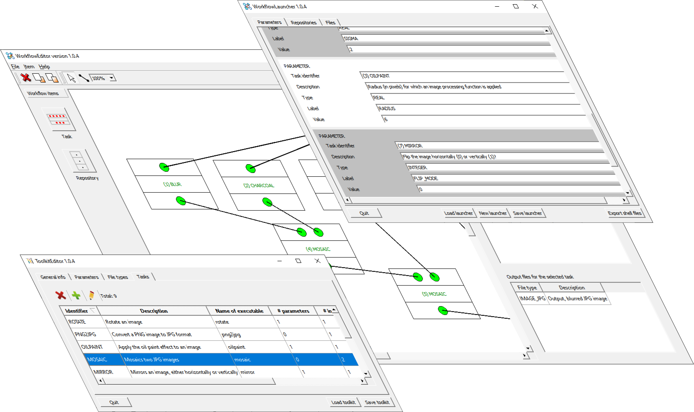
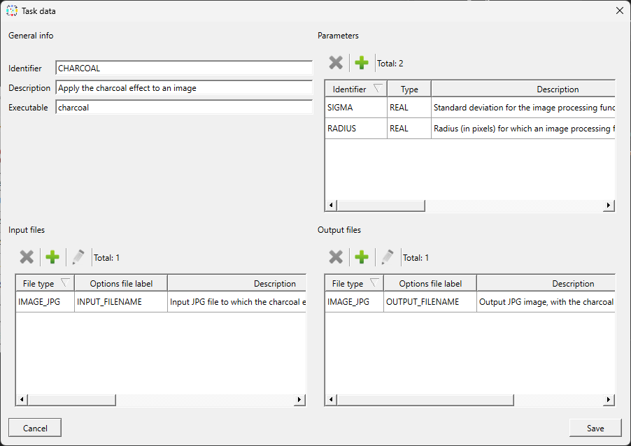
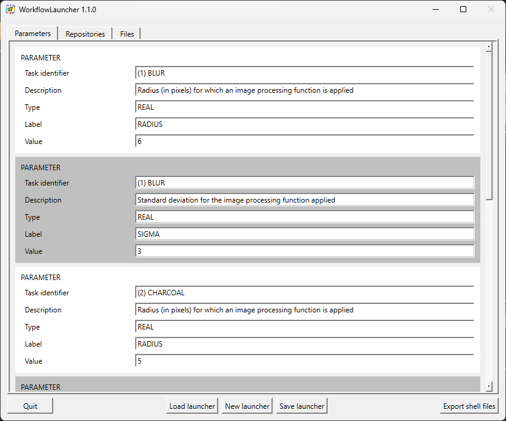

  

# WorkFlowMaker

## What is it for?

WorkFlowMaker allows you to design and execute workflows created from the
combination of so-called console applications.

A *console application* is one that does not have a Graphical User Interface (GUI)
and runs in a command window. Typically, these applications interact with the user
through parameters passed on the command line, the keyboard (for entering data),
and data files (input/output).

It is common for applications of this type to be generated in research and even
production environments, since they are not affected by the complexity of
developing a GUI.

On certain occasions, it will be necessary to combine several of these
applications to achieve more elaborate results. Normally this is done through a
manual process. The user executes, one by one, the required applications until
obtaining the final result.

This can be a tedious and error-prone process. In cases where it is necessary to
combine a specific set of console applications, it would be interesting to have
scripts that automate this process. However, not everyone is capable of writing
such scripts, so they will depend on other people who are capable of doing so.

WorkFlowMaker tries to solve this problem by allowing users *without programming
knowledge* to combine these console applications using a graphical tool that
allows them to add/remove applications to a workflow and connect the input and
output files of these applications using connections. With such a tool, users without
programming skills but with knowledge of the domain in which they are working
will be able to generate scripts that execute their workflows without the need to
write a line of code.

To achieve this, WorkFlowMaker imposes a few restrictions that explain how console
applications should be programmed. Thanks to these restrictions it is possible to
formalize the definition of these applications and, from here, draw these
workflows and generate scripts to execute them. Obviously, developers who want
to be able to integrate their console applications with WorkFlowMaker will have to
respect these restrictions.

### WorkflowMaker at a glance ###

#### Target ####

WorkflowMaker is a set of visual tools whose gool is making possible the
visual design of workflows integrating self-developed console applications as
well as the generation of the necessary scripts to run these workflows.

Thanks to WorkflowMaker, there is o need to write a single line of code to
design and execute your own workflows.

#### Features ####

* Design of workflows by visually combining tasks implemented as 
  console applications.
* Visual connection of the inputs and outputs of said tasks. 
* Automatic generation of scripts to execute the workflows thus designed.
* No programming knowledge required.
* Easy to use graphical interface.

#### Benefits ####

* Reduce errors when manually combining tasks, either manually or by means
  of self-written scripts.
* Save time.
* Users _with no programming knowledge_ may create their own workflows.
* Workflows are self-documented.

#### Use cases ####

* Research.
* Production. 
* Education.
* Training.
* Any activity where self-developed console applications are implemented.

#### Availability ####

WorkflowMaker and the sample image processing toolkit are available for Windows
10 / 11 as well as Ubuntu 24.10-based Linux distributions.

## I am a developer. Can *any* console application be integrated in a WorkflowMaker workflow?

The short answer is **no**. There are many console applications that cannot be
integrated, as they do not meet a series of restrictions that WorkflowMaker
imposes for such integration to be carried out.

Nevertheless, for developers interested in WorkflowMaker, it is very simple to
create new applications that can be integrated, as the restrictions to be met are
very few and easy to comply with. In fact, it is so simple that it is possible to
adapt non-compatible applications to be integrated with WorkflowMaker, as long as
the source code is available, of course.

### What are the restrictions that a console application must meet to be integrable with WorkflowMaker? ###

In short, WorkflowMaker-compatible console applications must comply with the
following restrictions:

* They must be console applications, that is, having no GUI, implemented as
  executable files.
* All their inputs and outputs must be files.
* They must accept a single command line parameter, the name of an options file
  stating what are the values of the typical parameters that would be input using the keyboard as well as the names of the input and output files.
* They must return a status code stating whether they ended successfully (return
  code 0) or not (any other value).

The options file must be a plain text file consisting of lines of labels and
values pairs, such as

MAX_NUMBER_OF_ITERATIONS = 5

INPUT_FILE = /home/some_user/my_data/the_input_file.dat

Thanks to this restrictions the interface of the applications is *standardized*,
which makes possible that a generic workflow design tool as WorkflowMaker be capable
of integrating any type of console application.

### May I use any programming language to create these compatible console applications? ###

Yes, providing that:

* it produces executable files (not files requiring an interpreter),
* that it is possible to read the command line to retrieve the name of the options
  file and,
* that a status code may be returned.

A **non-exhaustive** list of these languages could be:

Ada / C / C# / D / Haskell / Fortran / Go / Pascal / Rust / Swift /
Visual Basic.NET.

Interpreted languages, such as java or phyton are not **yet** supported. It is
planned that future releases of WorkflowMaker will be able to handle applications developed with these kind of programming languages.

## I am interested but I am **not** a developer ##

If you are working in a workplace where someone else develops applications that
may be made compatible with WorkflowMaker, then you are also a potential user of
this (set of) tools.

WorkflowMaker consists of three tools:

1. **ToolkitEditor**. This is the application that **developers** will use to
   formally define what their console applications do. Non-developers need not to
   know about ToolkitEditor.

2. **WorkflowEditor**. For **all users**. This is the keystone on which
   WorkflowMaker relies. It is a graphical editor where the applications previously
   defined with ToolkitEditor may be added and combined with others. To *draw*
   these *workflows* users only need to know about the *goal* of each task in the
   design, *not* about how these have been implemented. That is, if you are an
   expert in, let's say, geodesy, but have no programming skills, you will be able
   to create workflows dealing with geodesy just by drawing your
   processes made of several tasks (console applications) and connecting their
   input and output files visually.

3. **WorkflowLauncher**. For **all users**. The workflows designed with
   WorkflowEditor above are just *templates*. With WorkflowLauncher any user may
   use these templates first defining the dataset to use and  then run said
   workflow by means of an automatically generated script (for either Windows or Linux).

In short, if you are not a developer you just need the domain knowledge for which
some developer(s) created a set of applications that have been made compatible
with WorkflowMaker.

## Are there any installers?

**Yes**.

In the [Releases](https://github.com/jose-navarro/workflowmaker/releases) section you can
download the WorkFlowMaker installer for Windows or a compressed file including a .deb package
for Ubuntu-based distributions.

WorkflowMaker works on Windows 10 & 11 computers. Regarding Linux, WorkflowMaker is available
for distributions based on Ubuntu 24.10 such as Linux Mint 22 Wilma&mdash;these are the only ones
supported nowadays due to the limited amount of human resources available.

## Are there any pre-built toolkit examples?

**Yes.**

There are also installers (Windows, Ubuntu-based) for a pre-built *example image
processing toolkit* that may be used to start practising without having to create a toolkit on
your own. It is also available in the [Releases](https://github.com/jose-navarro/workflowmaker/releases)
section.

## Where is the documentation?

The user guides for the *WorkFlowMaker suite* may be found at the following path of the repository:

docs/user guide/*.pdf

The available documents are:

* *WorkflowMaker user guide* (file: WorkflowMaker user guide.pdf). **For all users.**
  This is the guide to understand WorkflowMaker. It explains how to create
  WorkflowMaker-compatible console applications, how to define these and group them in so-called
  toolkits using ToolkitEditor, how to design (draw) workflows visually that rely on these
  toolkits and how to, finally, use them to process your own data thanks to WorkflowLauncher.

* *Building WorkflowMaker* (file:Building WorkFlowMaker.pdf ). **For developers only:**
  this guide is targeted at describing how to build WorkflowMaker from source code, both for
  Windows and Linux platforms. It describes the tools required, the steps to build automatically
  the complete suite of applications and, also, how to build the libraries or applications
  manually.

* *Building a WorkflowMaker-compliant console application* (file: Building a compliant console
  application.pdf).  **For developers only:** in this case, a step by step example is provided,
  showing how to build a WorkflowMaker-compatible console application. The example is written
  in C++, but the ideas there explained are valid for any programming language. Note that the
  example application is one of the console applications included in the example image
  processing toolkit.

With regard to the *example image processing toolkit*, there are two folder to check:

* samples/image_processing/docs/*.pdf

  * *The image processing sample toolkit* (file: The image processing sample toolkit.pdf).
    **For all users, but mainly for developers**. 
    This document describes a very simple set of image processing console applications that,
    put together, make a so-called toolkit. The description is made from the WorkflowMaker
    standpoint, explaining the steps that must be taken to build said toolkit. Therefore, it is
    highly advisable to read the "WorkflowMaker user guide" first. In the case of
    **regular users** (not developers) this guide explains what the different tasks in the
    toolkit do, so it is a good starting point to understand how to combine these in useful
    workflows. **Developers** should also read this guide since it explains, step by step, how to define an operational
    toolkit.

  * *Building the samples* (file: Building the samples.pdf). **For developers only.**
    If you are interested in building the sample toolkit, this guide explains how.

* samples/libraries/simple_options_file_parser/docs. **For developers only.** There is a single document in this
    folder, *Simple options file format description* (file: Simple options file
    format description.pdf). All the tasks in the sample image processing toolkit
    rely on a basic C++ library that simplifies the task of parsing label / value
    options file. Therefore, to help understanding the tasks in said sample
    toolkit, this document is included, which describes the format supported by
    this library.

## Are there any documents describing the API? ##

Yes. The API for the main WorkflowMaker library as well as for the three tools are
included in HTML form in the corresponding subfolders. These are:

* *WorkflowMakerLib*: libraries/WorkflowMakerLib/doc_html

* *ToolkitEditor*: tools/ToolkitEditor/doc_html

* *WorkflowEditor*: tools/WorkflowEditor/doc_html

* *WorkflowLauncher*: tools/WorkflowLauncher/doc_html

For the example image processing toolkit, the only API documentation included
is that of the library that all example tools use to parse their input
option files, namely *simple_options_file_parser*. The API docs for this
library may be found here:

* *simple_options_file_parser* library: samples/libraries/simple_options_file_parser/doc_html

There are no API docs for the sample tools included in this toolkit since these are
very simple.

In *all* cases the file to open is *index.html*.

The API of the rapidxml library is documented in
[its own web page](https://rapidxml.sourceforge.net/manual.html)

Note that the API HTML documentation is generated whenever WorkflowMaker or the sample
image processing toolkit are built.

## How may I build from source code?

Read the guides related to building from source code. Again, the documents
to read are:

* *Building WorkflowMaker* and
* *Building the samples*.

Section *Where is the documentation?* above explains where these documents may be found.

## Tell me how to get started

The following subsections will tell you how to proceed to start using
WorkflowMaker.

### I want a quick start to learn how to use WorkflowMaker ###

Here detailed instructions to install both WokflowMaker and the example
image processing toolkit are given.

**First**, install the suite of WorkflowMaker applications:

1. Download the WorkFlowMaker installer / deb package from the
[Releases](https://github.com/jose-navarro/workflowmaker/releases) section. 

2. Install WorkFlowMaker on your computer (for Windows, the installer is a
   classic next->next process; for Linux, the deb package may be installed using
   GDebi &mdash;double clicking on the deb file&mdash;or using the console).

3. Take a look at the WorkflowMaker user guide to learn where to find the
   relevant information about the tools. All user guides are part of the
   installation kit (either included as a subfolder in the Linux installer
   or as a specific folder created by the installer on Windows, which may
   be accessed via the Start menu).

**Then**, install the pre-built example image processing toolkit. This toolkit
includes the executable files of a series of console applications dealing with
image processing tasks, such as rotation, format conversion, effects of several
kinds, etc. The installer (Windows) appends their path to the system's
path, so they may be executed directly: there's no need to prepend the
path to the folder where they stay. On Linux boxes the applications are stored
in /usr/local/bin, so they become immediately accessible.

Furthermore, these applications have been characterized using ToolkitEditor so they
are ready to be used: it is possible to draw workflows and then execute them.

1. Download said example image toolkit, either Windows installer or the
   deb package for Linux. Both versions are available in the
   [Releases](https://github.com/jose-navarro/workflowmaker/releases) section.

2. Install the toolkit using the appropriate method for Windows or Linux.

3. Copy the WorkflowMaker sample files listed below to some writable folder on
   your computer. On Windows, these are available via the Start menu; look
   for the WorkflowMaker menu entry and then for a sub-entry pointing to the
   samples folder. On Linux, these files are packaged in the samples and docs
   subfolder of the WorkflowMaker package. The files to copy are:
   
   * *image_processing_toolkit.xml*. This file includes the *formal definition
      of all the tasks* included in the example image processing toolkit. As
      stated above, this definition was made using the ToolkitEditor tool.
      Note that this file **must not be modified**; otherwise, the remaining
      files in the example will become unusable. However, it is possible to
      open it with ToolkitEditor to see how the tasks have been defined.

   * *image_processing_workflow.xml*. This is an *example* workflow, showing
      how the different tools included in the toolkit may be combined to
      produce a more complex result. Note that you may design your own workflows
      instead; this one is provided as an easy starting point to get used
      to WorkflowEditor. **Warning**: to keep the integrity of the sample, this
      file should not be modified; if changes are made, these should not be
      saved. Otherwise, the launcher below will become unusable.

   * *image_processing_launcher.xml*. As stated above, workflows are just
      templates defining how to process some data. With a launcher, it is
      possible to give values to parameters, names to input and output files
      and paths to the folders where these reside. This launcher corresponds
      to the workflow and toolkit above; it includes values for all the said
      items (although some of them must be changed, see below).

4. Use WorkflowEditor to play with image_processing_workflow.xml. The
   recommendation is not to save the changes, so the launcher provided
   with the example toolkit may be used without problems. However,
   it is possible to add, remove, move tasks or repositories to learn
   how to do this providing that said changes are not saved.

5. Switch to WorkflowLauncher to assign values to, at least, (1) the paths
   where your input and output folders stay as well as (2) to the name
   of the unique input file (an image in PNG format). Note that this is
   mandatory, since paths are specific to every computer and may not
   be preset. Then, save the changes to the launcher file and create
   the scripts to run the workflow. Note that the name of the script is
   always go.bat (Windows) or go.sh (Linux). Make sure that the input and
   output repositories (folders) exist and that the input PNG image is properly
   copied into the input folder with the name stated in the launcher. Finally,
   open a command line and run said script.

Obviously, it is possible to design other workflows besides the one included
with the sample; and then, it is possible to create the corresponding launcher
to provide data values and execute the workflow. The only thing that
should never be done when playing with this sample toolkit is modifying
the toolkit file itself (image_processing_toolkit.xml) since this would
corrupt the formal definition of the tasks it contains.

Note that to fully understand the directions above, reading the WorkflowMaker
user guide before proceeding is rather convenient. The user guide describing
the example image processing toolkit is bundled with the toolkit installer
(Windnows) or package (Linux). Such guide describes the console applications
included in the toolkit.

### I want to develop my own toolkit ###

Developing a self-made WorkflowMaker toolkit implies a sound knowledge of the
concepts on which this software suite relies. Therefore, it is recommended to
read the WorkflowMaker user guide as well as those explaining how the
sample image toolkit is implemented. The documents to read are:

* *WorkflowMaker user guide*

* *Building a WorkflowMaker-compliant console application*

* *The image processing sample toolkit*

All these documents are included with the installers. If you do not plan to
install WorkflowMaker yet, the section *Where is the documentation?* above
explains where to find these documents in the repository tree.

## Image gallery ##

  

<em>Figure 1: The ToolkitEditor - Defining a task.</em>

  

<em>Figure 2: Drawing a workflow with WorkflowEditor.</em>

  

<em>Figure 3: Providing data to launch a workflow with WorkflowLauncher.</em>

  

<em>Figure 4: The icons of the three WorkflowMaker's applications.</em>

## The licenses ##

WorkflowMaker relies on several open source several components. Below, its own
licence as well as those of the auxiliary packages are reproduced.

### WorkflowMaker ###

*A copy of the MIT license may be found in /docs/licenses/LICENSE as well
as in the root folder of the repository.*

The MIT License

SPDX short identifier: MIT

Copyright 2024 Centre Tecnològic de Telecomunicacions de Catalunya-CERCA

Permission is hereby granted, free of charge, to any person obtaining a copy of this software and associated documentation files (the "Software"), to deal in the Software without restriction, including without limitation the rights to use, copy, modify, merge, publish, distribute, sublicense, and/or sell copies of the Software, and to permit persons to whom the Software is furnished to do so, subject to the following conditions:

* The above copyright notice and this permission notice shall be included in all copies or substantial portions of the Software.

* THE SOFTWARE IS PROVIDED "AS IS", WITHOUT WARRANTY OF ANY KIND, EXPRESS OR IMPLIED, INCLUDING BUT NOT LIMITED TO THE WARRANTIES OF MERCHANTABILITY, FITNESS FOR A PARTICULAR PURPOSE AND NONINFRINGEMENT. IN NO EVENT SHALL THE AUTHORS OR COPYRIGHT HOLDERS BE LIABLE FOR ANY CLAIM, DAMAGES OR OTHER LIABILITY, WHETHER IN AN ACTION OF CONTRACT, TORT OR OTHERWISE, ARISING FROM, OUT OF OR IN CONNECTION WITH THE SOFTWARE OR THE USE OR OTHER DEALINGS IN THE SOFTWARE.

### The rapidxml library ###

WorkflowMaker uses the rapidxml library, which is available under the Boost 
Software License. For more information, visit https://www.boost.org/LICENSE_1_0.txt. A copy of this license may be found in */doc/licenses/Boost_Software_License_1_0.txt*.

### The Qt 6 framework ###

This application uses the Qt 6 framework, which is available under the LGPL v3
license. For more information, visit https://www.qt.io/licensing and https://www.gnu.org/licenses/lgpl-3.0.html. A copy of the LGPL v3 license may be found in  */doc/licenses/LGPL_v3_License.txt*.

### The ImageMagick library ###

All the tasks included in the sample image processing toolkit rely on the libraries above. In their case they also make use of on the ImageMagick library, which is available under ImageMagick license. For more information, visit https://imagemagick.org/script/license.php. A copy of the ImageMagick license may be found in */docs/licenses/ImageMagick_license.txt*.