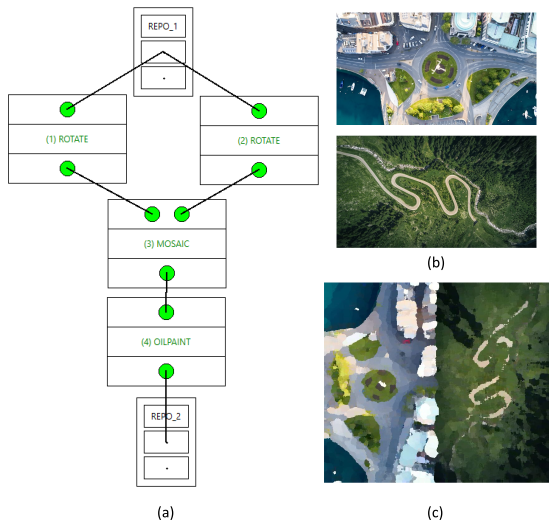

# Summary

WorkflowMaker is a set of tools aimed at the *visual design* and subsequent *execution* of
workflows that integrate *console applications* developed by users themselves, whether in
research or production environments involving in-house software development.

In this context, *visual design* means *drawing* the workflow by including tasks (the
applications) and connecting their inputs and outputs, thereby creating a *template* that
specifies who does what (applications) and how information flows between them
(data connections). *Execution* means automatically generating the necessary scripts
(for Windows or Linux) to process the data according to the designed workflow.

The goal of WorkflowMaker is to reduce the complexity of combining different console
applications to create said workflows. It seeks to eliminate the need for manual
execution of these applications or the writing of automation scripts, which require skills
that not everyone possesses. This approach makes it possible for these applications to be used
not only by their developers but also by any expert in the application field, even if they
lack programming skills.

# Statement of need

It is not surprising to find research or production groups that create their own software.
Often, however, despite being experts in their field of knowledge, only some members of
these groups have programming skills.

Developers in these groups are able to create console applications to solve specific problems
with relative ease, as these do not include graphical interfaces. By combining them in
different ways, it is possible to achieve more complex results. However, doing so either
requires manually running the applications one by one or writing scripts to automate the
process. This, which may be easy for developers, can be a stumbling block for those without
programming skills, who need to rely on their more qualified colleagues to do it.  This limits
the flexibility of the group, creating dependencie among its memberss&mdash;and bottlenecks.

The author believes it would be highly beneficial if those without programming skills
could design workflows by combining the applications created by their colleagues using a tool
that (1) would literally allow them to draw such workflows and (2) automatically generate the
necessary scripts to execute them.

However, and although it is very difficult to prove the absolute non-existence of something, the 
author has not been able to find a visual tool to draw and execute workflows made of console
applications.

@ref-journal-kuhail carried out an exhaustive review of articles related to visual programming.
The conclusions of this study on target fields of application are: 23.3 % of the tools are
focused on the Internet Of Things (IOT) 
[@ref-inproc-valtolina; @ref-journal-danado; @ref-journal-francese; @ref-journal-johnsson];
another 23.3 % is oriented towards education
[@ref-proceeding-kunimune; @ref-proceeding-abe; @ref-journal-broll; @ref-journal-deluca; @ref-journal-feng; @ref-proceeding-rao];
the remainder are spread across the fields of Business Process Management (BPM)
[@ref-journal-weber], museum exhibits [@ref-inproc-stratton], reporting [@ref-journal-chen],
records management [@ref-proceeding-cabitzaiade], geographic information [@ref-proceeding-luong],
robotics [@ref-proceeding-alexandrova], mechanical engineering [@ref-inproc-sorce], information
visualization [@ref-journal-mei], and psychiatry [@ref-proceeding-rough]. 

A less academic search for tools, whether open-source or proprietary, 
produced a long list. The best ones, according to 
[@ref-web-pathak; @ref-web-boitnott; @ref-web-towns] are listed here in alphabetical order:
Airtable [@ref-web-airtable], Appy Pie [@ref-web-appypie], Betty Blocks [@ref-web-bettyblocks],
Bubble [@ref-web-bubble], Carrd [@ref-web-carrd], Caspio [@ref-web-caspio], Jotform
[@ref-web-jotform], Knack [@ref-web-knack], m-Power [@ref-web-mpower], Mailchimp
[@ref-web-mailchimp], Mendix [@ref-web-mendix], Microsoft Power Apps [@ref-web-powerapps],
Notion [@ref-web-notion], OutSystems [@ref-web-outsystems], Quickbase [@ref-web-quickbase],
Retool [@ref-web-retool], Shopify [@ref-web-shopify], SNAP [@ref-web-esa], Visual LANSA
[@ref-web-vlansa], Webflow [@ref-web-webflow], Zapier [@ref-web-zapier] and  Zoho Creator
[@ref-web-zohocreator]. For a very extensive list of visual programming / workflow / no-code /
low-code tools please refer to [@ref-web-g2bsr].

Most of the tools above are targeted at BPM; they let users build workflows visually, connecting 
data and processes. Usually, they offer standard data stores (such as commercial or open-source 
databases or spreadsheets) and applications available in the market to be used as the nodes in 
the workflow. Other applications are aimed at marketing / email distribution or website / e-shop 
builders. Unfortunatelly, there is not a single tool to build workflows integrating console
applications.

# Description

# References
